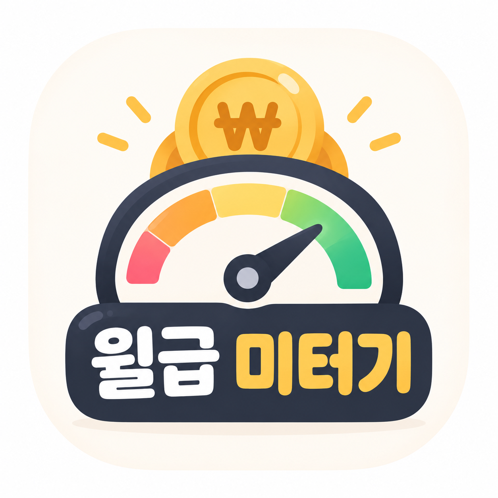
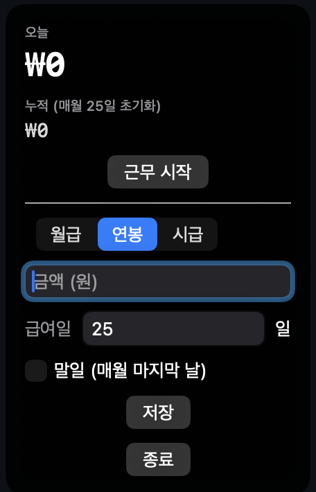
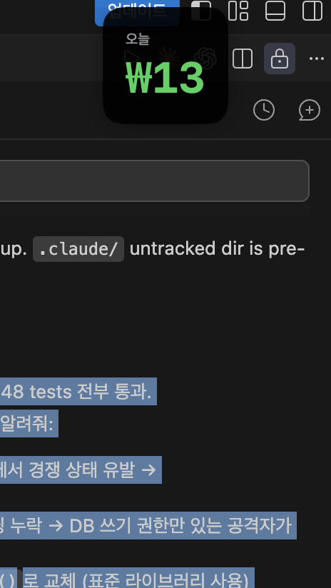
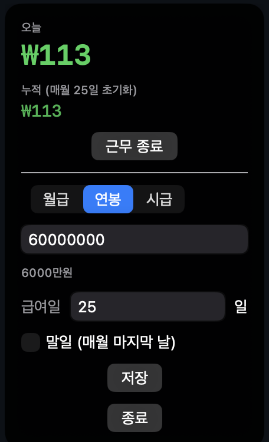

<p align="center"></p>

# 월급 카운터 펫 (Time Is Money)

macOS 메뉴바에 상시로 떠 있는 택시 미터기 스타일 급여 카운터.
월급/연봉/시급을 넣으면 근무 중에 초 단위로 돈이 올라가는 걸 실시간으로 보여준다.

## 스크린샷

대기 상태 (근무 전, 흰색 숫자):



근무 시작 후 (오늘 숫자만 보이는 컴팩트 모드, 초록색):



상단바 아이콘 클릭 → 상세 화면 (근무 종료 버튼, 급여 설정):



## 기능

- 상단바에 항상 떠 있는 플로팅 패널 (다른 앱 위에 강제로 표시, 화면에서 안 잘림)
- 월급 / 연봉 / 시급 중 선택해서 입력
- 근무 시작을 누르면 초당 금액이 올라가고, 화면은 오늘 번 돈만 크게 보여주는 컴팩트 모드로 전환
- 근무 중엔 상단바 아이콘을 눌러야 상세(설정/종료) 화면으로 돌아옴
- 돈 버는 중엔 초록색, 멈춰 있으면 흰색
- 급여일(매월 며칠) 지정 가능, "말일" 체크박스로 매월 마지막 날 자동 처리 (28~31일 자동 대응)
- 오늘 번 돈은 근무 종료 후 3시간이 지나면 자동으로 0원 초기화, 자정에도 초기화
- 누적 금액은 급여일 전까지 유지, 급여일이 지나면 초기화
- 상세 화면에 근무 시작/종료 시각 표시
- 캘린더 화면에서 최근 3개월간 하루하루 얼마 벌었는지 확인 가능
- 만원 이상은 "1.5만원" 처럼 축약 표시, 급여 입력 칸에는 "1만90원" 처럼 정확한 금액을 풀어서 같이 보여줌
- 금액/급여일 입력칸은 숫자만 입력 가능

## 다운로드 방법

### 1) 빌드된 앱으로 바로 실행 (권장)

[Releases](https://github.com/tpgusgh/money_meter/releases) 에서 `TimeIsMoney-x.x.x.zip`을 받아 압축을 풀고 `TimeIsMoney.app`을 더블클릭.

앱 서명이 없어서(Apple 유료 개발자 계정 미가입) 처음 열 때 "확인되지 않은 개발자" 경고가 뜬다.
`TimeIsMoney.app`을 우클릭(또는 control+클릭) → **열기** → 열기 를 누르면 이후엔 정상적으로 더블클릭 실행 가능.

### 2) 소스로 직접 빌드 (요구사항: macOS 13 이상 + Xcode Command Line Tools)

```bash
git clone https://github.com/tpgusgh/money_meter.git
cd money_meter
./scripts/build_app.sh        # dist/TimeIsMoney.app 생성
open dist/TimeIsMoney.app
```

개발 중 빠르게 띄워볼 땐 `swift run`도 가능.

## 사용 방법

1. 앱을 실행하면 메뉴바에 원화 아이콘이 뜨고, 화면 오른쪽 위에 패널이 뜬다.
2. 패널에서 월급/연봉/시급 중 하나를 고르고 금액을 입력한 뒤 **저장**을 누른다.
3. 급여일(예: 25일)을 입력하거나, 매달 마지막 날이 급여일이면 **말일** 체크박스를 켠다.
4. **근무 시작**을 누르면 카운터가 올라가기 시작하고, 패널은 오늘 번 금액만 보이는 작은 모드로 바뀐다.
5. 근무를 끝내려면 메뉴바의 원화 아이콘을 눌러 상세 화면을 연 뒤 **근무 종료**를 누른다.
6. 앱을 완전히 끄려면 상세 화면의 **종료** 버튼을 누른다.

## 개발

```bash
swift build   # 빌드
swift test    # 계산 로직 테스트
```

## 라이선스

[MIT](LICENSE)
